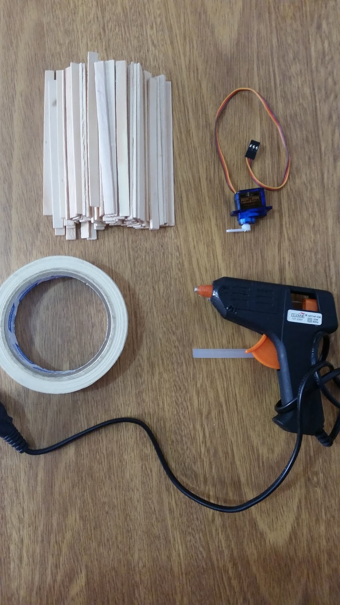
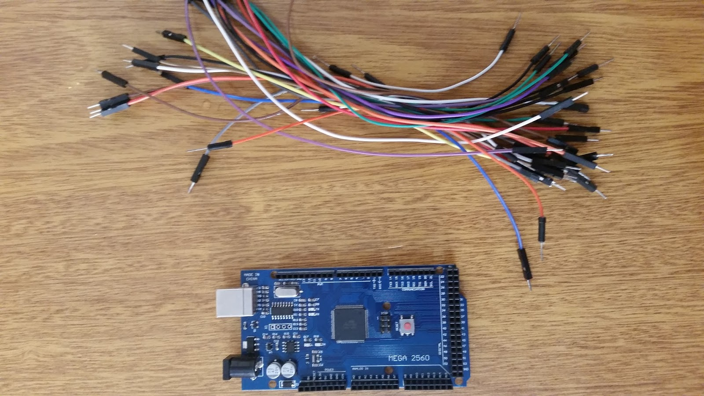
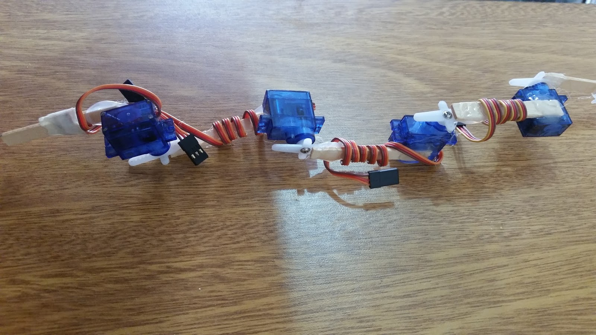
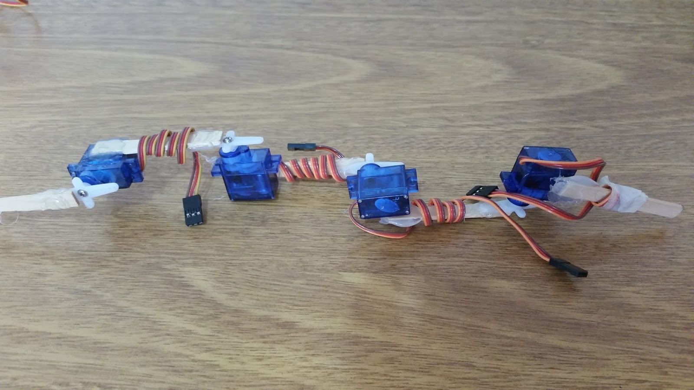
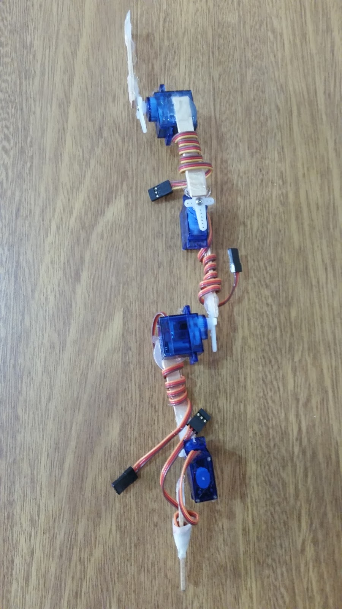
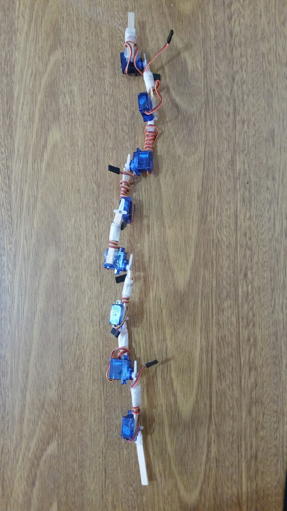

# Snakie, the rescue bot!
### Summary and purpose

* [Introduction](#Introduction)
* [Material](#Material)
* [Assembly](#Assembly)
* [Programming](#Programming)
* [Hints](#Hints)

It was almost weekend when a professor called and invited me to join an automation competition between all students of the exact sciences institute at my college in that time. The challenge to make the whole project from scratch for the competition in only 2 days deeply excited me besides the obvious chance to hone my ability to think creatively under self-pressure and do the best concept I could do. My efforts made me win the competition.

## Introduction
"Snakie" is a conceptual design prototype for a robot with immense purpose. As natural disasters get stronger, crumbling even entire cities sometimes, a device that can easily get over almost all physical obstacles while detects any human presence, is something that could really save lives.

This manual covers just the bare base to make the project and there are lots of possible improvements in both hardware and software terms.

**The project can be seen live and running at this [video](https://www.youtube.com/watch?v=LcXjLIC2zg0) on YouTube and high resolution images can be found at the end of this documentation.**

# Material
* **Hot glue pistol**
    * Approximately **a 30 centimeters long** and **8 milimeters thick glue tube**
* **Paper**
    * **1 piece** of **waxed paper** with **10 centimeters width** and **15 centimeters length** size
* **Arduino**
    * **1 UNO compatible** boards
* **Motors**
    * **8 units** of **9g SG90 micro servo** motors
* **Sticks**
    * Approximately **half the number of motors** used, in **wooden popsicle** sticks of **8 centimeters length**
* **Sensor**
    * **1 PIR** sensor
* **Jump wire**
    * Aproximately **100+ units** of **150 milimeters length** jump wire

Some image references regarding the used materials are available.
> Image references **[#1](#1)**
    
# Assembly

## Motor nodes
The servo motors used for this prototype are quite small and just half of a wooden stick is enough to let the robot execute complex movements stably and precisely.
Each motor node can be done placing one end of a half wooden stick over one of the flat sides of a servo motor and gluing both togheter.

After repeating that process with all remaining servo motors, take a servo motor glued with the half wooden stick and place the remaining end over the horn of another motor node, also gluing them togheter. Doing that step with each two of the remaining motor nodes creates the articulated piece of the image references.

> Image references **[#2](#2)**

## Sensor mount

Take the PIR sensor and simply wrap the waxed paper around it, pulling the back circuitry of the sensor a little outside the tunnel created. That configuration allows the sensor to get a more precise data from which direction the heat source comes from while searching for it.

## Putting all togheter
1. Place the sensor mount at one end of the robot articulated segment and glue them togheter. 
2. Wrap the extra length of the servo motor wires around their respectively wooden stick and put a drop of hot glue over to not let it mess around and disarrange in future steps.

> Image references **[#3](#3)**

3. Connect all jump wires and wrap them following the length of the robot, until all connections can loosely reach the tail.
4. Place any other weighty pieces like the Arduino board, at the tail and wrap them to the robot using a bad conducting yet strong element like a thick cotton twine or something similar.

# Programming
It is recommended to use the most updated version of the standard **Arduino IDE** to upload the code into the boards.
The code is maintained in this [Github repository](https://github.com/phtdacosta/snakie-robot-project) and can still be updated if needed.

The code can automatically set the frame sequence to be executed by each board. Download the `.ino` file, upload it to each one of the boards and make sure to use a push button attached to the pin 2 of the board which controls the left side and to the pin 3 of the board which controls the right side. The code is simple and any tweaks should be easy to do.

# Hints

### Important matters to care about
* Budget
    * This concept can be done with as few as 3 motors but complex moves tend to not be easily performed.
* Power
    * Pay serious attention on your microcontroller power specifications! If not sure about how many motors the microcontroller could handle without frying itself, use instead a small breadboard as the means to distribute the power from the source to the electronic parts.
    * Moves that combine more than the half of the joints at once are going to drain a lot of power what can cause a current peak. Be sure to use power sources that could handle high current peaks by a good margin or you can get big problems!
* Autonomy
    * As the number of servo motors increases, more advanced moves the robot can perform. On the other hand, the required number of wires, current consumption and overall weight is going to increase as well.

### Possible improvements
* Think beyond the standard power sources. Depending on the target environment, the robot can recharge itself using available light or even ambient heat.
* Countermeasures as a diverse array of sensors for autonomous self-control or smart and modular joints that could split from the main body can enourmously improve the odds for a successful mission under any conditions.
* The project do not implements any external communication interface, an indispensable feature for any search and rescue team and similarly, to a robot with such purposes. Depending on the environment, a wired hardware could be much more effective than a wireless one.
* Altough the robot can detect human presence quite well, the code does not get yet the precise angle, or the direction, that the signal came from. Implementing such big feature is relatively simple to do.

### 1.

*Materials*

### 2.

*Articulated segment*

### 3.

*Putting all togheter*

## License
The project is totally **open source** under the **MIT license**.